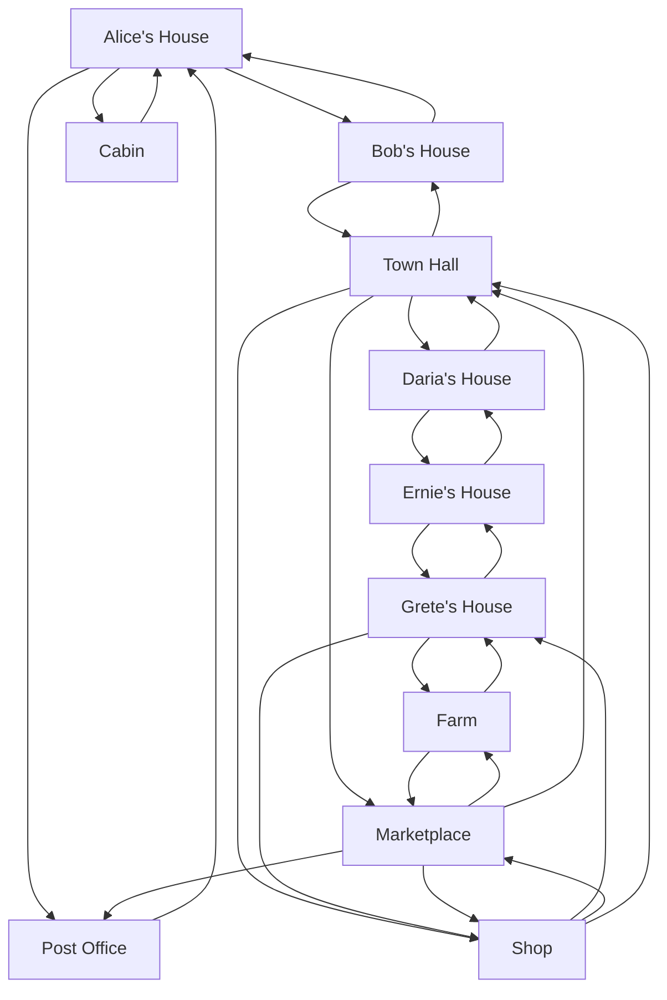

# amazon-clone-using-react
This is an e-commerce clone i worked on personally using React, nodeJs and firebase.
I integrated react-router-dom for moving through pages, i used material Ui to get and use icons, i used react-currency-format to build the subtotal page before
checkout.
I tried integrating stripe for payment earlier on but then i realized stripe does not work in nigeria so i integrated payment using paystack instead.
The code i used for paystack payment integration can be found on the paymentTwo component in the src folder
I also created a time stamp page for orders after successful processing of payment. I did this using firebase and firestore.
It was an interesting and woderful project and i learnt a lot working on it

